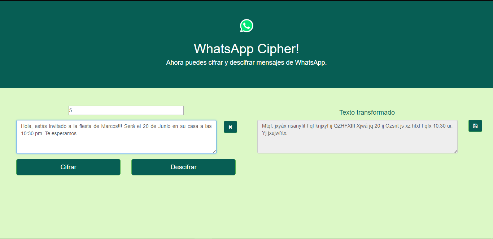

# [WhatsApp Cipher](https://anaflaviadiaz.github.io/lim-2018-05-bc-core-am-cipher/src/)

## Te ha pasado que alguien espía tus mensajes de WhatsApp?

Ahora puedes proteger tus mensajes con [WhatsApp Cipher](https://anaflaviadiaz.github.io/lim-2018-05-bc-core-am-cipher/src/), una aplicación que permite cifrar o descifrar un mensaje, lo que volverá más difícil espiar tus mensajes.

Solo tienes que poner un texto que quieras cifrar o descifrar y verás el texto cambiado. Ahora podrás compartir tus mensajes con las personas que quieras sin que se enteren los demás.

Entra aquí: [WhatsApp Cipher](https://anaflaviadiaz.github.io/lim-2018-05-bc-core-am-cipher/src/) y prueba la app.

## Cómo lo usas?

1. Debes ingresar un número de desplazamiento, por defecto aparece el número 5 pero puedes modificarlo a tu conveniencia.

2. Debes ingresar el texto que quieras cifrar o el texto que te mandaron para decifrar.

3. En el caso que quieras Cifrar el texto(ocultar el contenido de tu texto actual) apretas el botón para "CIFRAR" y tu resultado se mostrará a la derecha.

4. En el caso que quieras Descifrar el texto(hacer entendible el contenido del texto que te mandaron) apretas el botón para "DESCIFRAR" y tu resultado se mostrará a la derecha.

5. Puedes copiar el resultado que obtuviste.

## Quién puede utilizarlo?

Va dirigido a todo el público que utiliza WhatsApp.
